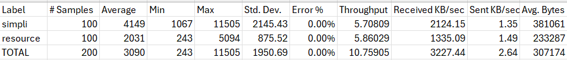
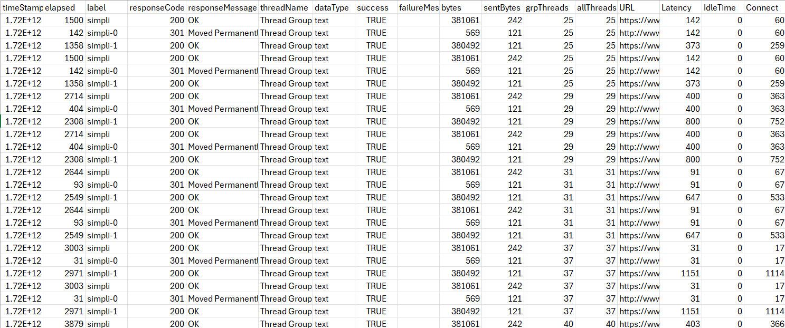
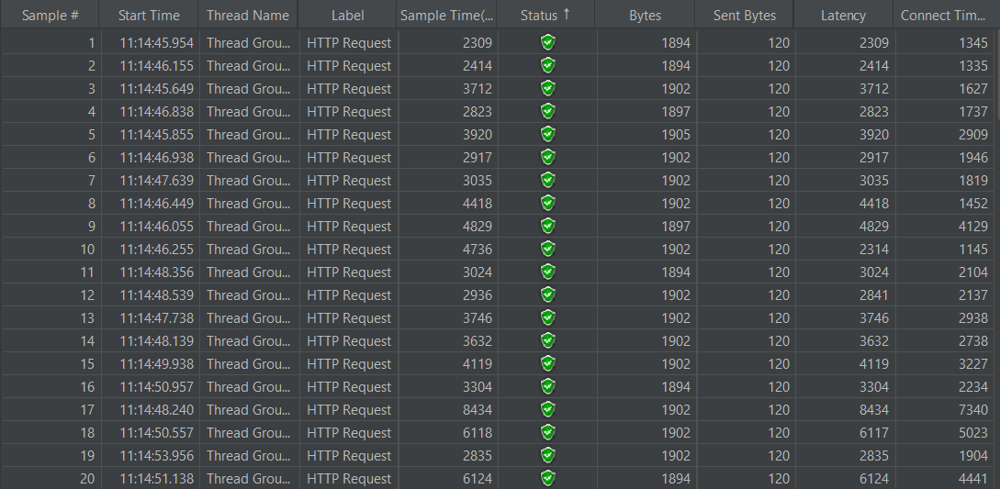
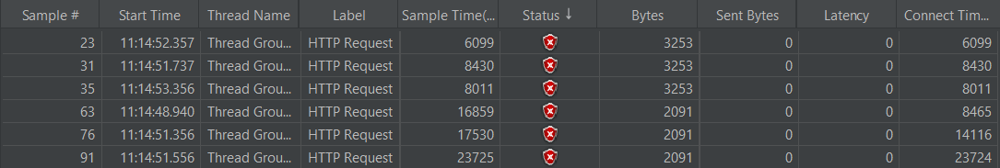

# Test_jMeter

1. Kiểm tra hiệu năng trang web:
Kiểm tra trang web: https://www.simplilearn.com
Kịch bản kiểm tra: 
    - Thread Group:
        Number of Threads (users): 100
        Ramp-up period (seconds): 10 giây
        
    - HTTP Request:
        URL: https://www.simplilearn.com
        Method: GET

Kết quả kiểm tra:
    

    

Kết luận:
    Trang web https://www.simplilearn.com có hiệu năng tốt. Với kịch bản đã kiểm tra số lượng yêu cầu thành công rất cao (100%) và không có yêu cầu thất bại (0%). 

2. Kiểm tra hiệu năng API:
Kiểm tra API: https://reqres.in

Kịch bản kiểm tra: 
    - Thread Group:
        Number of Threads (users): 100
        Ramp-up period (seconds): 10 giây
        
    - HTTP Request:
        URL: https://reqres.in/api/users
        Method: GET

Kết quả kiểm tra:
    

    

Kết luận:
    Trang web https://reqres.in có hiệu năng tốt. Với kịch bản đã kiểm tra số lượng yêu cầu thành công ở mức khá (94%) và số lượng yêu cầu thành công ở mức 6% vì vậy có thể ảnh hưởng đến trải nghiệm người dùng.

3. So sánh hiệu năng của hai trang web hoặc API:
Kiểm tra 2 trang web: https://www.accuweather.com/
                      https://www.theweathernetwork.com/ca

Kịch bản kiểm tra: 
    - Thread Group:
        Number of Threads (users): 100
        Ramp-up period (seconds): 10 giây
        
Kết quả kiểm tra:
    

